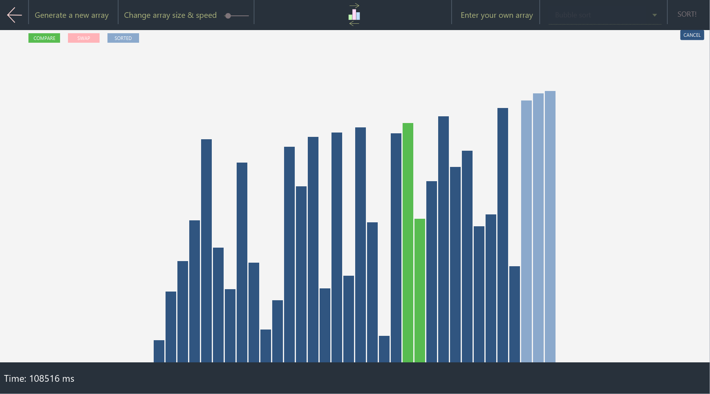

# Java sorting visualizer

This program allowed to view the process behind some sorting algorithms. 
You can change the speed of the process to get a better view, the total array size 
You can also insert your own input via a txt file, or by adding them manually.  
Preview:  

## Running the program
Make sure you have at least java 11 and maven installed on your computer 
1. Open a command line in the root directory and type: mvn clean install
2. Type: mvn compile
3. Type: mvn exec:java
